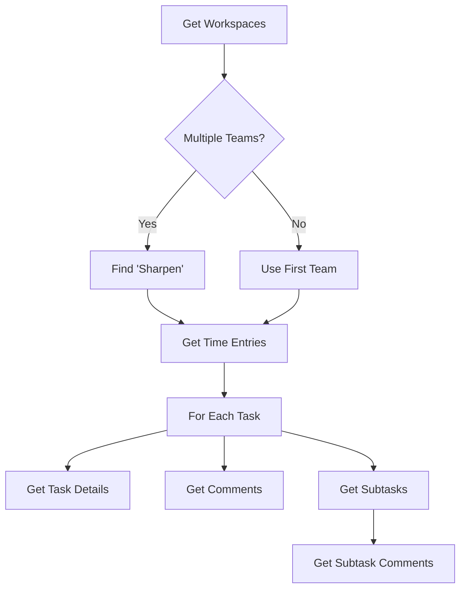
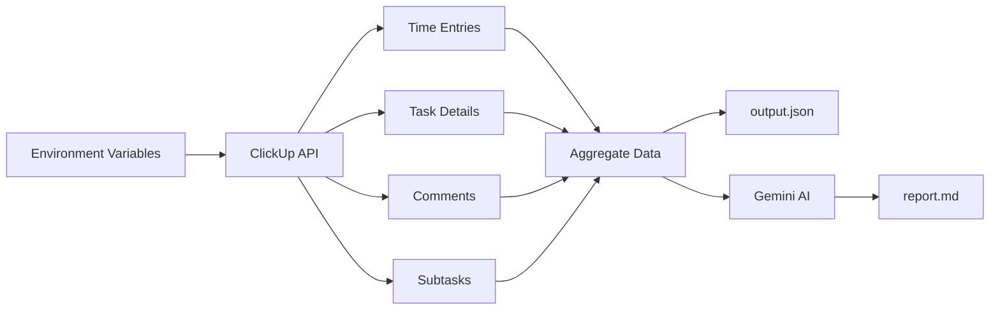

# System Patterns

## Architecture Overview
Single Python script with linear execution flow:
1. Environment setup
2. ClickUp API authentication and data retrieval
3. Data processing and organization
4. AI analysis and report generation

## Key Components

### 1. Date Range Calculator
**Purpose**: Calculate previous week's Sunday-Saturday range

**Implementation**:
```python
today = datetime.now()
days_since_sunday = (today.weekday() + 1) % 7  # Sunday = 0
last_sunday = today - timedelta(days=days_since_sunday + 7)
previous_sunday = last_sunday.replace(hour=0, minute=0, second=0, microsecond=0)
previous_saturday = previous_sunday + timedelta(days=6, hours=23, minutes=59, seconds=59)

# Convert to Unix timestamps in milliseconds
start_timestamp = int(previous_sunday.timestamp() * 1000)
end_timestamp = int(previous_saturday.timestamp() * 1000)
```

**Design Decision**: 
- Uses local system time (not timezone-aware yet)
- Future enhancement: Add timezone awareness using `zoneinfo`
- ClickUp API requires milliseconds, hence multiplication by 1000

### 2. ClickUp Data Retrieval
**Flow**:


**Pattern**: Nested data aggregation
- Start with time entries (filtered by date)
- Build task dictionary keyed by task_id
- Enrich with task details, comments, and subtasks
- Each subtask includes its own comment history

### 3. Data Structure
```python
tasks = {
    "task_id": {
        "id": "task_id",
        "name": "Task Name",
        "time_entries": [...],
        "comments": {...},
        "subtasks": {
            "subtask_id": {
                # Full subtask data
                "comments": {...}
            }
        }
    }
}
```

**Design Rationale**:
- Task-centric organization (not time-entry-centric)
- Complete context per task for AI analysis
- Subtasks nested for hierarchical understanding

### 4. AI Integration
**Model**: Google Gemini (`gemini-3-flash-preview`)

**Prompt Engineering**:
- System instruction defines AI role as "successful executive"
- User prompt includes:
  - Full task data as JSON
  - Explicit timestamp range with context
  - Timezone instruction (Eastern)
  - Required report structure
  - Advisory section requirement

**Critical Instructions**:
- Focus only on updates within date range
- Use full history for context
- Be honest about issues (not overly effusive)
- Prioritize project status over employee performance

### 5. Error Handling
**Pattern**: Fail-fast with exceptions
- All API calls check status codes
- Throw exceptions with descriptive messages
- No retry logic currently implemented

## Technical Decisions

### Why Not Timezone-Aware?
Current implementation uses naive datetime objects. Future enhancement planned to use `zoneinfo.ZoneInfo("America/New_York")` for proper Eastern Time handling.

### Why Milliseconds?
ClickUp API requires Unix timestamps in milliseconds format, not standard seconds.

### Why Task-Centric Organization?
AI needs complete task context to generate meaningful summaries. Time-entry-centric structure would fragment this context.

### Why Include Full Comment History?
Allows AI to understand project evolution and context, even though report focuses on recent period.

## Data Flow Diagram


## Critical Implementation Paths

### Path 1: Workspace Selection
If multiple workspaces exist, script hardcoded to find "Sharpen". This is project-specific and should be configurable in future versions.

### Path 2: Date Filtering
API call includes `start_date` and `end_date` parameters to filter time entries at source, reducing data transfer and processing.

### Path 3: Nested Iteration
Two-level iteration pattern:
1. Iterate tasks from time entries
2. For each task, iterate subtasks from task details

This ensures complete data collection while maintaining referential integrity.